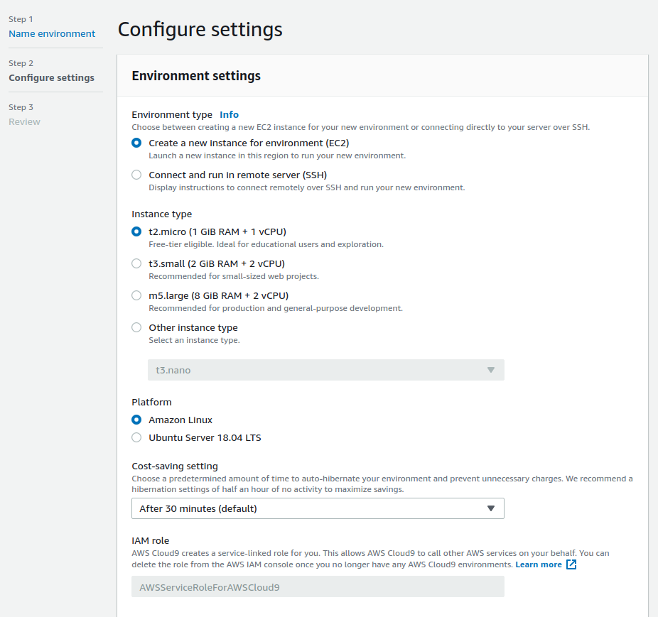
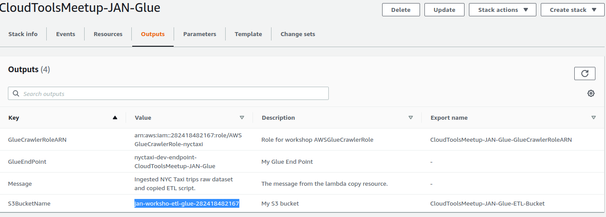
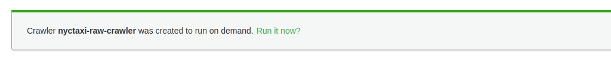
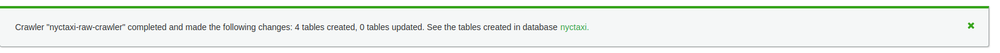

# Creating the data and setting up the environment

We need to create a new cloud9 environment with name **NYC-workshop-aws-meetup** and set the configuration as shown below:



Check out the workshop code using 
```
git clone https://github.com/daghanacay/AWS_GlueETL_workshop.git && cd AWS_GlueETL_workshop/Step1
```

We will first set up the data from NYC taxi trips from Jan to March 2017 approximately 2M rows in 3 files and 2.5GB uncompressed data. This will take approximately 10 mins. Execute the command below in Cloud9

```aws cloudformation deploy --template-file setup_roles.yaml --stack-name CloudToolsMeetup-JAN-Glue --capabilities CAPABILITY_NAMED_IAM```

The AWS CloudFormation template will create the following key resources for you.
- A new Amazon S3 bucket
- Necessary IAM policies and roles for AWS Glue, Amazon Athena, Amazon SageMaker, and AWS Lambda
- An AWS Glue development endpoint
- An AWS Lambda function that can copy NYC Taxi trips raw dataset files into your Amazon S3 bucket

You can check the progress of the stack [here](https://console.aws.amazon.com/cloudformation/home?region=us-east-1#/stacks/stackinfo?filteringText=&filteringStatus=active&viewNested=true&hideStacks=false&stackId=arn%3Aaws%3Acloudformation%3Aus-east-1%3A282418482167%3Astack%2FCloudToolsMeetup-JAN-Glue%2Fc3cd9d50-27a9-11ea-b0fe-0e353767367b). After the stack creates successfully, go to the Outputs tab and Look for the key S3BucketName. **Copy and keep its value**. This is your Amazon S3
bucket's name that we will use throughout the workshop. 



Go to your S3 and inspect the bucket and see the raw data.

# Creating Glue Crawler and Glue catalog 

Glue Crawler automatically detects the schema of your raw data by classifying its format (CSV, TSV, ...). It also detects the field types automatically and put it to Glue Data Catalog. Glue data catalog is a centralized metadata repository that can be shared by different services such as Athena and Redshift to query unstructured data. Glue crawler also collects information about number of lines, number of files etc. Before we run the Glue crawler we need to create one. Go to [Glue Crawler](https://console.aws.amazon.com/glue/home?region=us-east-1#catalog:tab=crawlers) and click "Add Crawler"

- On enter **Crawler name** nyctaxi-raw-crawler and click next
- Select **Data stores** adn click next
- On Data store step
  - Choose **Specified path in my account**
  - In **Include path**, copy-and-paste an NYC Taxi dataset S3 URL: ```s3://<your_bucket_name>/data/raw/nyctaxi/```
  - Click **Next** twice skipping the add another datastore
- On **IAM Role** step
  - Click **Choose an existing IAM role**
  - In **IAM Role** menu, choose **AWSGlueCrawlerRole-nyctaxi** This role was created for you in the previous step.
- Click **Next** on **Schedule** step indicating you want the crawler run on demand.
- On **Output** step
  - Click **Add database** → enter **nyctaxi** as the name and leave the **Prefix added to tables** empty
  - Expand Configuration options → select **Add new columns only**
  - Click **Next**
- Click **Finish**
Finally, click on the green Run it now. This will take approximately 1 minute.




# Explore Glue Catalog

You can access the Glue Catalog from the message on the top 



You can alternatively go to [Databases](https://console.aws.amazon.com/glue/home?region=us-east-1#catalog:tab=databases) and find **nyctaxi** and click on it. You need to click **Tables in nyctaxi** to see the tables generated by the crawler. You should see tables called **yellow**,
**paymenttype**, **ratecode**, and **taxizone**. If you click on **yellow** then you can see:
- Classification, showing the table was classified as CSV
- objectCount, showing how many files were found
- sizeKey property, showing total dataset size
- recordCount property, showing total number of records
- compressionType, showing the files are compressed in bzip2

Scroll down, examine table schema. Fields have been identified along with their potential datatypes. You can manually change any datatype.

# Summary

You can create metadata about your datasets in Glue Catalog. Glue catalog is a central repository for specifying your schemas and is used by many other AWS services such as Redis and Athena.

Congratulations you have finished the Step1 of the workshop. now please move to [Step2](../Step2/README.md)