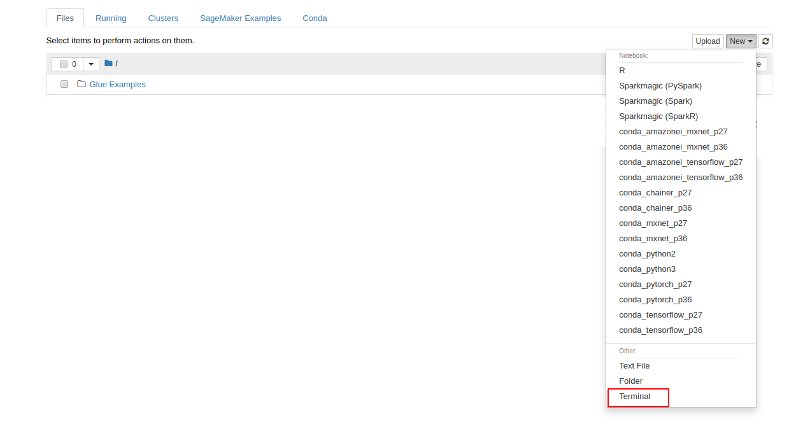
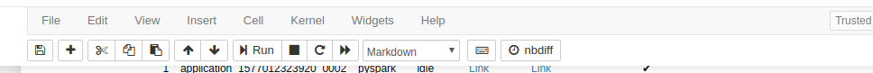
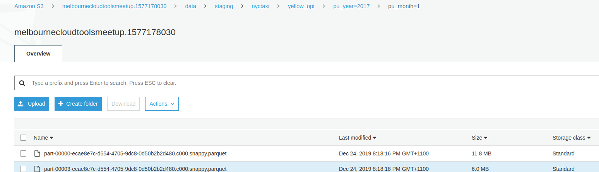

# Query Raw Data with Amazon Athena

You can directly go to [Athena Console](https://console.aws.amazon.com/athena/home?force&region=us-east-1#query) and start querying your NYC data using Glue Catalog created previously. Amazon Athena is a serverless interactive query service that makes it easy to analyze data in Amazon S3 using standard SQL. It integrates with the AWS Glue data catalog and takes advantage of the metadata registered by AWS Glue crawlers.

However, we would like to generate a pre-canned queries for you so you can modify them. In order to get the Athena queries run the following on Cloud9 environment. But move to Step2 folder first, ```cd ../Step2``` and run

```aws cloudformation deploy --template-file setup_athena.yaml --stack-name CloudToolsMeetup-JAN-Athena --capabilities CAPABILITY_NAMED_IAM```

After the stack creation is finished. Navigate to [Athena Console](https://console.aws.amazon.com/athena/home?force&region=us-east-1#query) console

- Ensure database nyctaxi is selected, and the four tables are listed: yellow, paymenttype, ratecode, and taxizone.
- Click on the tab Saved Queries
- In the search field, type nyctaxi:raw
- Click on the **sample_report_qry** query to open in Athena query editor Note: After opening the query, review the comment before the SQL statement.
- Click Run query
- Note query run time and data scanned. Copy and paste it into an open text file for later comparison.
- Repeat above steps for query **sample_agg_qry**

# Create optimized data set
 
Athena queries are costly and take too much time, which negatively impacts the user experience. There are some methods that will improve the query speed while reducing the cost of using Athena. In this section we will investigate the following strategies:
- Convert the dataset from CSV to a compressed and splittable columnar Parquet file format.
- Partition the dataset in Amazon S3 by year and month such that queries that filter on a specific year or month avoid scanning unnecessary data.
- De-normalize the dataset by joining the tables and creating a flat table.
- Finally, create new columns and drop unnecessary columns.

In order to apply such transformations we will create a Jupiter Notebook. Managed Jupiter notebooks in AWS are called SageMaker notebooks. In order to create a Sagemaker notebook
- Go to [Glue endpoints](https://console.aws.amazon.com/glue/home?region=us-east-1#etl:tab=devEndpoints) and verify that **nyctaxi-dev-endpoint-\*\*\*** is created and in **READY** state.
- In the left menu, under ETL → Dev endpoints, click Notebooks and click **Create notebook**
- For Notebook name, enter **nyctaxi-notebook** and select **nyctaxi-dev-endpoint-\*\*\*** for attached endpoint
- Select Choose an existing IAM role then choose **AWSGlueServiceSageMakerNotebookRole-nyctaxi**

Click Create notebook. It should take about 6 minutes to transfer into a Ready status. Meanwhile create a new S3 bucket using the following command. We will use this bucket to store the transformed files.

```
export BUCKET_NAME=melbournecloudtoolsmeetup.`date +%s`
aws s3 mb s3://${BUCKET_NAME}
```

After it is ready open the sagemaker notebook Terminal



- Write the following 
```
cd SageMaker && wget https://raw.githubusercontent.com/daghanacay/AWS_GlueETL_workshop/master/Step2/nyctaxi_raw_dataset_etl.ipynb
```

Double click on the **nyctaxi_raw_dataset_etl.ipynb** and ignore any errors. Follow the instructions in the SageMaker console. You can run each cell in sagemaker by clicking on run button after selecting the cell



Now inspect the output in your S3 bucket and see the partition created by the newly generated columns ```"pu_year" and "pu_month"```



# Query Optimized Dataset

Now we can find out how much we have saved from Athena query time by optimizing our dataset. Before we can do that, we need to create new tables using Glue Crawlers for the optimized dataset. We will do same as we did before and set up a Glue Crawler.

- Navigate to the AWS Glue console and add Crawler
- Enter crawler name **nyctaxi-optimized-crawler**, click Next.
- On Data store step...
 - Choose Specified path in my account
 - In Include path, enter:

s3://<you_bucket_name>/data/staging/nyctaxi/yellow_opt/. Replace <your_bucket_name> with the actual name of your Amazon S3 bucket.

- Add another data store, select **No**. Click Next, again.

On IAM role step...
- Click Choose an existing IAM role
 - In IAM Role menu, choose **AWSGlueCrawlerRole-nyctaxi**
- On Schedule step, click Next
- On Output step...
 - For Database, select **nyctaxi**.
 - Expand Configuration options → select Add new columns only

We choose this option when we plan on making changes to the table schema manually later on. In such a case, we do not want the AWS Glue crawler to
override our changes in subsequent runs.

- Click Next
- On Review all steps, click Finish
- Finally, click on the green Run it now? prompt at the top of the crawlers page. 

The crawler will run over the new optimized NYC Taxi trips dataset for a minute. It will then create a new table, called **yellow_opt** in the AWS Glue data catalog. You can go and check it under . Notice two new fields ```pu_year``` and ```pu_month``` and how they were identified as partitioning columns.

# Query Optimized data with Athena

Now we have an optimized data set we can start measuring the time and cost benefit of the changes. 
- Navigate to Amazon 
- Ensure database **nyctaxi** is selected. You should see the new **yellow_opt** table.
- Click on the tab **Saved Queries**
- In the search field, type nyctaxi:opt
- Click on the query sample_report_qry to open in Athena query editor
- Click Run query
- Observe query run time and data scanned. Compare with the results you saved from section "II.1.3 Query raw data with Amazon Athena" and notice the improvements.
- Repeat steps 3-7 for query **sample_agg_qry**

# Summary

Yu can improve the  the query performance and reduce cost by transforming you data into partitioned and flat format. You can also add or remove columns to shape the data in a query ready format.

Congratulations, you have finished the second step, please proceed to 

