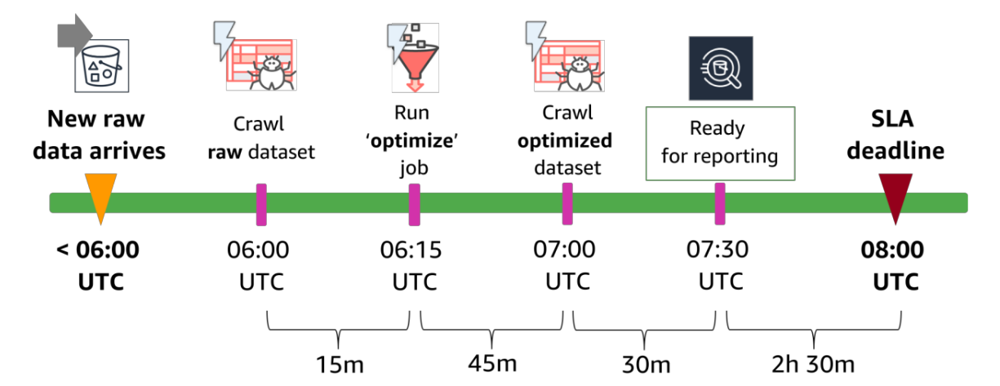
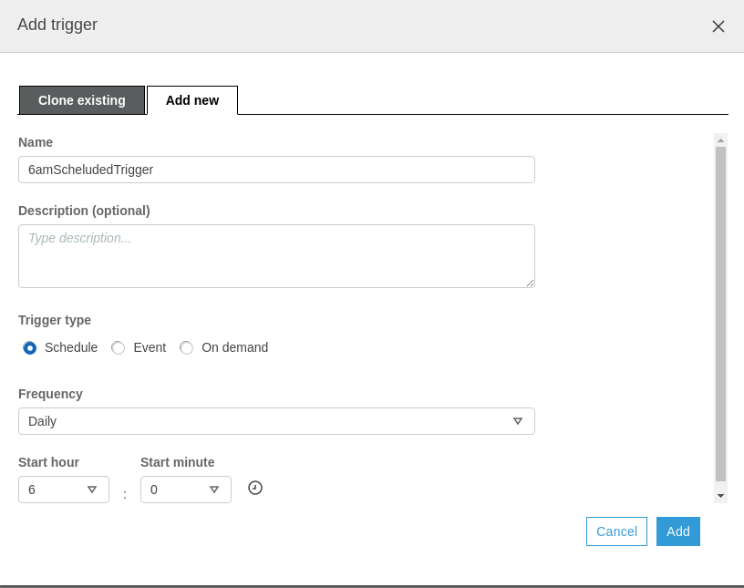
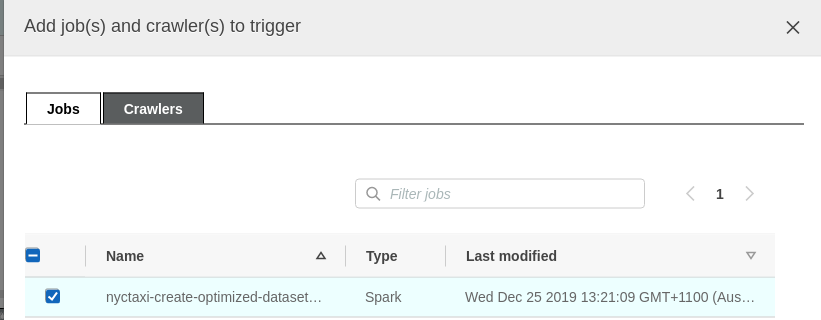
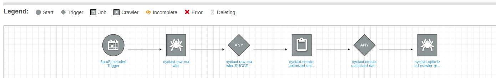
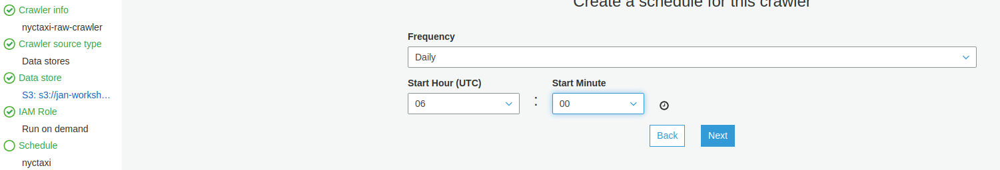

# Production Pipeline Using Glue ETL Workflows

Now we have a raw and clean dataset. However, you would not want to do this every day manually. We need to put this to production pipeline. In this section we will build a **Schedule Driven** Glue ETL pipeline. The pipeline will look like this:



# Create cleaning job

We will set up the cleaning job first. 

- In the left menu, under ETL, click Jobs. Click Add job. and name it **nyctaxi-create-optimized-dataset-job**
 - For IAM Role, select **AWSGlueServiceRole-nyctaxi-optimize-job**
- Select **Spark** for Type and **Spark 2.4, Python 3 (Glue Version 1.0)** for version
- Select An existing script that you provide
 - copy-and-paste this S3 URL: s3://<you_bucket_name>/scripts/nyctaxi_create_optimized_dataset_job.py. 

> TIP: You can find <your_bucket_name> from your cloud formation ```CloudToolsMeetup-JAN-Glue```` outputs.

 - For Temporary directory, specify the following S3 URL: s3://<your_bucket_name>/data/tmp
- Expand section Advanced properties
 - For Job bookmark, select Enable
 - For Job metrics, select Enable
- Expand section Security configuration, script libraries, and job parameters
 - For Max capacity, enter 4
- Find the section named Job parameters
 - Under Key, enter --your_bucket_name (two dashes, then the word your_bucket_name)
 - Under Value, enter <your_bucket_name> 
- Click Next
- In step Connections, click **Save Job and Edit Script**

You can run this AWS Glue job any time. With 4 DPUs allocated, it takes about 7-9 minutes from a cold start to complete. The job creates and writes an optimized NYC Taxi (Yellow) dataset to the following Amazon S3 path in your own account: s3://<your_bucket_name>/data/**prod**/nyctaxi/yellow_rpt

Let's now create our crawler for the new bucket. You can manually create the crawler as described in the earlier. This time you can also take automated approach if you wish and run the following to create the prod crawler.

```aws cloudformation deploy --template-file create_crawler.yaml --stack-name CloudToolsMeetup-JAN-Crawler --capabilities CAPABILITY_NAMED_IAM```

After the stack is created you can find your crawler **nyctaxi-optimized-crawler-prod** in . You can run the crawler and observe that new table is created under **nyctaxi** database.

# Putting the workflow together

Now we have 
- Crawler **nyctaxi-raw-crawler** that crawls the raw data and updates the Glue Tables for any schema changes
- Job **nyctaxi-create-optimized-dataset-job** that transforms the data into optimal format for query
- Crawler **nyctaxi-optimized-crawler-prod** that crawls the optimized datastore and updates the Glue Tables

It is time to put them together so they run everyday. We have two options here: create schedules on crawlers or create a workflow. Setting scheduling on the crawlers is useful for simple workflows. Some steps can be seen in section [Appendix](#appendix). We will not take this path in this workshop but feel free to try this at home.  Glue Workflow is handy when we need complex workflows or separate jobs and scheduling, separation of concerns (my favorite :). 

In order to create our workflow:
- Click on ETL -> **Workflows** on the left and click **Add Workflow** and name it **NYC production workflow** and click **Add Workflow**
- At the bottom click **Add Trigger**. Create a 6am trigger

- Click **Add Node** and select the Crawlers tab. Find the **nyctaxi-raw-crawler**
- Now click on the crawler image and click on the **Add Trigger** diamond and name it **nyctaxi-raw-crawler-SUCCESS**

- Click **Add Node** next to the trigger, select the Jobs tab, Find the **nyctaxi-create-optimized-dataset-job**

- Now click on the job image and click on the **Add Trigger** diamond and name it **nyctaxi-create-optimized-dataset-job-SUCCESS**
- Finally, click **Add Node** select the Crawlers tab. Find the **nyctaxi-optimized-crawler-prod**

Congratulations now you have an end to end pipeline that will trigger every morning at 6:00am


> TIP!: You can find and modify your schedules and events from [Triggers section](https://console.aws.amazon.com/glue/home?region=us-east-1#etl:tab=triggers) 


You can do much more with workflows, For example:

- You can do join patterns where next step starts if all the previous steps are successful
- You can handle error events triggers to send message or do some correction action

You can explore Glue [here](https://docs.aws.amazon.com/glue/latest/dg/what-is-glue.html). 

If you have not done so I suggest you follow [Step4](../Step4/README.md)


# <a name="appendix"></a> Appendix (Optional): Setting up schedular on the crawler.

- Navigate to the AWS Glue console and select **nyctaxi-raw-crawler**, then click **Edit**
- In the left list of steps, click on **Schedule** and set it to daily 6:00am UTC



- In the left list, click on **Review all** steps and click **Finish**

