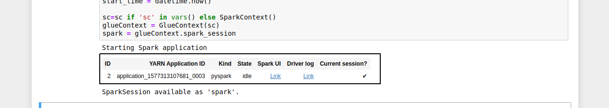

# Solve Machine Learning Problem

In this section we will use cleaned data for some machine learning tasks. At a high level we will:

- Data Cleansing – Remove biased features (e.g. remove samples with payment_type as ‘CASH’ as most drivers don’t report tips for cash payments)
- Feature Trend Analysis – Understand trends in data relative to label (Tip Amount) to remove biased samples
- Feature Engineering – Extract features from raw data and transform features to make them suitable for training (e.g. convert day of week string to numeric and then binary vector)
- Data Split – Split data into Training dataset and Test dataset
- Training and Hosting Model – Using SageMaker spark SDK, launch XGBoost training, model creation and endpoint creation
- Run Predictions – Derive predictions using Spark transform () method

First of all get the sagemaker notebook from the source.
- Open the Terminal on the Sagemaker notebook

- Write the following 
```
cd SageMaker && wget https://s3-eu-west-1.amazonaws.com/ant313-workshop-dub/notebooks/nyctaxi_tips_prediction_xgboost.ipynb
```
- Go back to your SageMaker console and open the **nyctaxi_tips_prediction_xgboost.ipynb**.
- Make sure that **SparkMagic (PySpark)** is selected. Run the first cell and see the spark environment is created 


